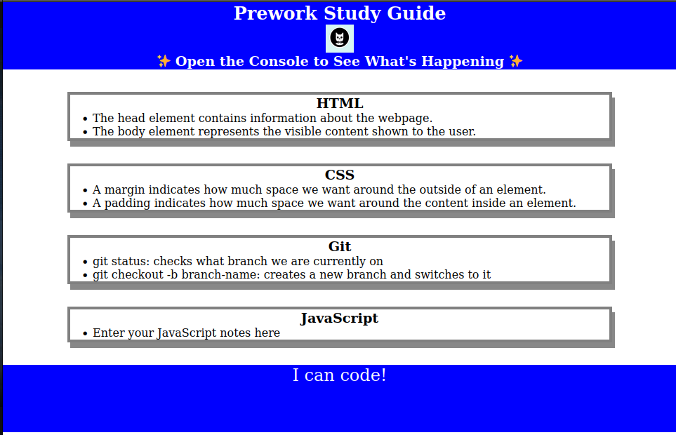

# Prework Study Guide Webpage

## Description

The purpose of this project is to provide a study guide of HTML, CSS, Git, JavaScript, and Markdown.

- What was your motivation?
    - My motivation for undertaking this project stemmed from a desire to gain proficiency in HTML, CSS, Git, JavaScript, and Markdown. I recognized the importance of these technologies in modern web development and seek to enhance my skills in these areas.
- Why did you build this project?
    - The primary objective behind building this project was to deepen my understanding of HTML, CSS, Git, JavaScript, and Markdown. By actively working on a project that incorporates these technologies, I aimed to reinforce my knowledge, explore their practical applications, and gain hands-on experience in developing web content.
- What problem does it solve?
    - To have a resource I can go back to in order to remember different aspects about these subjects.
- What did you learn?
    - Throughout the project, I learned various concepts and techniques related to HTML, CSS, Git, JavaScript, and Markdown.

## Installation

None

## Usage

## Credits

None

## License

See license in repo.
